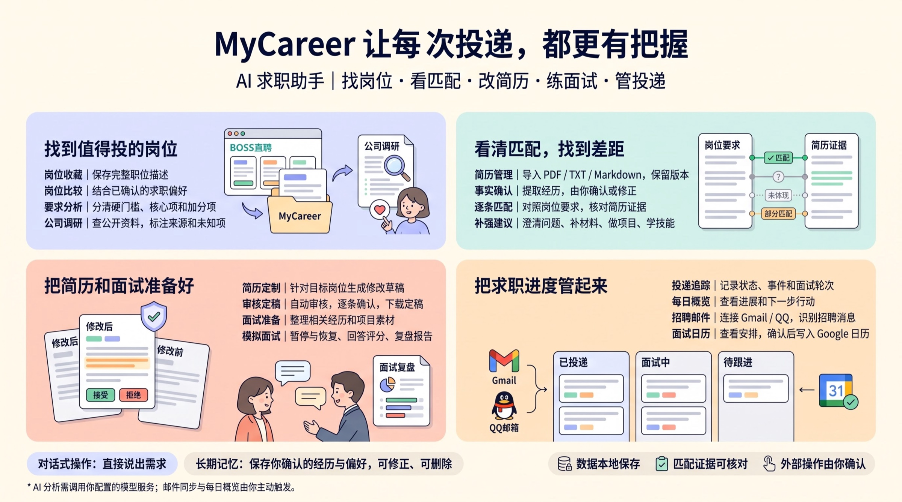

<div align="center">

# MyCareer

**跑在你自己电脑上的 AI 求职助手**

找岗位 · 看匹配 · 改简历 · 练面试 · 管投递

[](https://github.com/low-hands/MyCareer/stargazers)
[](LICENSE)
[](https://www.python.org/)
[](https://nodejs.org/)
[](#数据与隐私)

</div>



求职时，JD 在浏览器里、简历在文件夹里、投递进度在脑子里、面试安排在邮箱里。MyCareer 把它们放进同一个本地工作区：你用对话把事情交给 Agent，它去查岗位、比简历、改草稿、陪你练面试、记进度。

- **数据本地保存**：岗位、简历、投递和对话都存在你电脑上的 SQLite 里，没有中心服务器。
- **匹配证据可核对**：每条"符合"都引用你简历里的原文；没有证据的地方只会标成缺口，不会替你编经历。
- **外部操作由你确认**：写日历、改记忆这类动作，都要你点确认才会执行。

## 功能

### 🔍 找到值得投的岗位

- **岗位收藏**：装上 Chrome 扩展后，在 BOSS 直聘岗位详情页点一下，就把完整 JD 存进岗位库。只有你点击才会保存，扩展不会自动搜索或投递。
- **岗位分析**：把 JD 要求分成四档：硬门槛、核心要求、重要加分、普通加分，每一条都附上对应的 JD 原文。分错了可以改，系统会同时保留原判断和你的修正。
- **岗位比较**：结合你确认过的求职偏好，比较几个岗位哪个更值得继续看。覆盖率的算法是公开的：完全符合算 1、部分符合算 0.5、缺失算 0，看不出来的不计入。
- **公司调研**：针对岗位库里的岗位检索公开资料，每条结论都标明来源，并区分"事实""推断"和"未知"。

### 🧩 看清匹配，找到差距

- **简历管理**：导入 PDF、TXT 或 Markdown。每次导入都是一个不可改的版本，可以随时打开原文件。简历按目标岗位分组，也能移到别的岗位下；重复上传同一个文件不会存两份。
- **事实确认**：从简历里提取经历（"第 2 页：负责内部搜索平台开发……"），你确认或修正后，才会用于后续匹配。
- **逐条匹配**：拿指定的简历版本对照岗位的每条要求，结论只有四种：匹配、部分匹配、未体现、不明确。整体结论分为强、中、弱和证据不足，这不是录用概率。
- **补强建议**：针对缺口给出下一步：澄清问题、补材料、做项目或学技能。

### ✍️ 把简历和面试准备好

- **简历定制**：针对目标岗位生成修改草稿，每条修改都必须引用原简历的内容。草稿先给你看，后台同时自动审核有没有夸大；审核通过后逐条接受或拒绝，再下载定稿。
- **面试准备**：根据投递和面试轮次，整理相关经历和项目素材。
- **模拟面试**：
  - 可以针对某次投递练，也可以自由练习。自由练习开始前会先问你用哪份简历（也可以现场上传，或者不用简历），可以指定岗位库里的岗位，也可以只说一个公司。
  - 开始时先按岗位出好整场的题，逐题提问，根据你的回答决定要不要追问。默认 10 道主问题，每题最多追问 2 次。
  - 常见大厂（字节、阿里、腾讯等）会参考它们的面试侧重。如果你做过这家公司的调研，也会结合调研里的业务背景出题。
  - 整场结束后逐题评估：从准确性、相关性、具体性、结构、推理和表达六个方面，每项 1–5 分，再生成复盘报告，并指出前后回答里互相矛盾的地方。
  - 中途离开，可以从面试中心回到原对话接着答；练完或取消的练习可以"再来一次"。

### 📮 把求职进度管起来

- **投递追踪**：在外部平台投递后，在这里记一笔：选岗位、选当时用的简历版本、填投递时间。之后跟踪状态、事件和面试轮次。
- **每日概览**：Dashboard 和日报汇总进展和下一步要做的事。
- **招聘邮件**：连接 Gmail（只读）或 QQ 邮箱，识别招聘相关消息，由你确认后再更新进度。
- **面试日历**：在面试中心的月历里查看安排；连接 Google 日历后，确认一次写入一次。

### 💬 对话与记忆

- **对话式操作**：直接说出你想做什么。需要你选择或补充信息时，会弹出选项卡片；想自己填写，选"其他"就能在同一行输入。
- **长期记忆**：只保存你确认过的经历和偏好，可以修改、可以删除。Agent 自己的推断会单独存放，不会直接影响推荐或匹配。

## 界面预览

<table>
<tr>
<td width="50%"></td>
<td width="50%"></td>
</tr>
<tr>
<td><b>工作台</b><br><sub>投递进度、最近保存的岗位和下一步行动。</sub></td>
<td><b>岗位库</b><br><sub>完整 JD、结构化分析、简历匹配和投递状态。</sub></td>
</tr>
<tr>
<td width="50%"></td>
<td width="50%"></td>
</tr>
<tr>
<td><b>简历管理</b><br><sub>按目标岗位管理简历和版本，随时打开原文件。</sub></td>
<td><b>对话</b><br><sub>让 Agent 做公司调研，结论附来源，并标出公开资料无法确认的部分。</sub></td>
</tr>
</table>

## 快速开始

> **需要：** Python 3.11+ · [uv](https://docs.astral.sh/uv/) · Node.js `^20.19.0` 或 `>=22.12.0` · 一个 HTTPS 的 OpenAI 兼容模型接口
> 收藏 BOSS 岗位还需要 Chrome、Edge、Brave、Arc 等 Chromium 内核浏览器。

**1. 安装依赖**

```bash
uv sync --extra test
cd web && npm ci && cd ..
```

**2. 配置模型**

```bash
cp .env.example .env
```

至少填下面两组。两组可以先指向同一个模型服务：

```dotenv
# 主 Agent：负责对话和决定下一步做什么
MAIN_AGENT_BASE_URL=https://你的服务/v1
MAIN_AGENT_API_KEY=你的密钥
MAIN_AGENT_MODEL=你的模型名
MAIN_AGENT_TIMEOUT_SECONDS=120

# 专家模型：负责简历分析、匹配、定制、公司调研、邮件处理和模拟面试
RESUME_ANALYSIS_AGENT_BASE_URL=https://你的服务/v1
RESUME_ANALYSIS_AGENT_API_KEY=你的密钥
RESUME_ANALYSIS_AGENT_MODEL=你的模型名
```

`BASE_URL` 填 `/v1` 基地址或完整的 `/chat/completions` 地址都可以。`.env` 已被 Git 忽略，不要提交真实密钥。

**3. 创建本地访问密钥**

两条命令要用同一个 `--user-id`，这样网页和浏览器扩展保存的数据才属于同一个用户：

```bash
uv run career-agent api-keys issue --user-id local-user --name local-web \
  --scope workspace:read --scope workspace:write \
  --scope chat:write --scope settings:write --no-expiry

uv run career-agent api-keys issue --user-id local-user --name boss-extension \
  --scope capture:write --no-expiry
```

每条命令只显示一次 `secret`。把它们分别填进 `web/.env`：

```dotenv
CAREER_AGENT_WEB_API_KEY=第一条命令返回的_secret
VITE_CAPTURE_API_KEY=第二条命令返回的_secret
```

**4. 启动**

```bash
uv run career-agent-api        # 终端一，后端默认 http://127.0.0.1:8000
cd web && npm run dev          # 终端二，前端默认 http://127.0.0.1:5173
```

浏览器打开 http://127.0.0.1:5173 即可使用。`curl http://127.0.0.1:8000/ready` 返回 503 时，按响应里提示的配置错误检查 `.env`。修改 `web/.env` 后需要重启前端。

**5. 安装 BOSS 岗位收藏扩展（可选）**

1. 在 Chrome 打开 `chrome://extensions`，开启"开发者模式"。
2. 点击"加载已解压的扩展程序"，选择仓库里的 `browser-extension/`。
3. 用**同一个 Chrome 用户**打开 MyCareer 网页，并在其中登录 BOSS 直聘。
4. 打开 BOSS 岗位详情页，右下角会出现保存卡片，点击后才会写入岗位库。

扩展不会自动搜索、滚动、投递或发消息，也不会读取 Cookie、绕过平台验证。详见 [browser-extension/README.md](browser-extension/README.md)。

## 怎么用

**第一次上手**

1. 在"简历管理"导入简历（也可以直接拖进对话框），选好它属于哪个目标岗位。
2. 在对话里说"帮我分析这份简历"，确认提取出的经历。
3. 用扩展保存几个感兴趣的 BOSS 岗位。
4. 让 Agent 做匹配、比较岗位或公司调研。
5. 需要时发起简历定制：先看草稿，等自动审核通过后逐条确认，再下载定稿。
6. 投递后在"投递记录"记一笔，之后面试准备、模拟面试都可以从投递开始。

**可以这样说**

| 想做的事 | 例子 |
| --- | --- |
| 分析简历 | "帮我分析这份简历"（附上简历） |
| 看匹配 | "用 Agent开发 这份简历，对照岗位库里量霸科技那个岗位做个匹配" |
| 比较岗位 | "岗位库里这几个多模态实习，哪个更值得投？" |
| 公司调研 | "帮我调研一下岗位库里阿里巴巴那个岗位的公司情况" |
| 定制简历 | "针对这个岗位改一版简历" |
| 模拟面试 | "我要面字节了，帮我来场模拟面试" · "按阿里的风格练一场行为面，不用简历，5 道题" |
| 记投递 | "我投了量霸科技的 Agent 开发实习" |
| 看今天做什么 | "今天有什么要处理的？" |

模拟面试进行中直接在输入框回答就行；说"不练了"会结束这一场。

## 连接邮箱和日历（可选）

<details>
<summary><b>Gmail</b></summary>

<br>

需要先创建 Google OAuth Client。你授权 Gmail 时不需要填 Client Secret。

1. 打开 [Google Cloud Console](https://console.cloud.google.com/)，创建或选择一个项目。
2. 在 API Library 启用 **Gmail API**。
3. 在 Google Auth Platform 配置 OAuth consent screen；测试模式下把自己的 Google 邮箱加入 Test users。
4. 在 Clients/Credentials 中创建 **Web application** 类型的 OAuth Client。
5. 添加 Authorized redirect URI：`http://127.0.0.1:8000/v1/connections/google/callback`。
6. 在仓库根目录的 `.env` 中添加：

   ```dotenv
   GOOGLE_OAUTH_CLIENT_ID=你的_Client_ID
   GOOGLE_OAUTH_CLIENT_SECRET=你的_Client_Secret
   GOOGLE_OAUTH_CALLBACK_URL=http://127.0.0.1:8000/v1/connections/google/callback
   CAREER_AGENT_WEB_URL=http://127.0.0.1:5173
   ```

7. 重启后端，在"邮件追踪"页面点击"连接 Gmail"。这里只申请 Gmail 只读权限。

不要把 Client Secret 提交到仓库，也不要放进 `web/.env`。

</details>

<details>
<summary><b>Google 日历</b></summary>

<br>

不连接 Google 日历也能用：面试安排会显示在"面试中心"的月历里。

需要同步时，在同一个 Google Cloud 项目里启用 **Google Calendar API**，复用上面的 OAuth Client 和回调地址，然后在"面试中心"连接。每次写入日历前都会先给你看预览，确认后才执行。

</details>

<details>
<summary><b>QQ 邮箱</b></summary>

<br>

QQ 邮箱用 IMAP 授权码，不是登录密码：

1. 登录 [QQ 邮箱网页版](https://mail.qq.com/)。
2. 打开"设置 → 账号与安全 → 安全设置"。
3. 开启 IMAP/SMTP 服务，生成授权码。
4. 在"邮件追踪"页面点击"连接 QQ 邮箱"，填写完整邮箱地址和授权码。

授权码保存在系统钥匙串里，页面和接口都不会返回它。

</details>

## 数据与隐私

- 业务数据默认保存在 `~/.career-agent/`（多个 SQLite 文件和 `working-notes/`）；访问密钥默认保存在仓库的 `data/api_keys.sqlite3`。
- 项目没有中心服务器，你的岗位、简历、投递和对话不会上传给我们。
- 但它不是完全离线的：执行 AI 任务时，任务需要的内容会发给你配置的模型服务；使用 Google、QQ 邮箱和 BOSS 时，也受这些服务各自的数据政策约束。
- 邮箱和日历的连接凭据保存在系统钥匙串；`.env` 里的模型和 OAuth 密钥需要你自己保管好。

## 备份与恢复

开始存正式简历和求职记录之前，建议先养成备份习惯：

```bash
uv run career-agent backup create
uv run career-agent backup create --dest /Volumes/usb/career-2026-09-14
uv run career-agent backup verify --source ~/.career-agent-backups/20260914T120000Z
uv run career-agent backup restore --source ~/.career-agent-backups/20260914T120000Z --yes
```

- 备份和恢复前请先停止后端；后端运行时命令会拒绝执行（加 `--allow-running-api` 可以强制备份，但会标记为不一致的快照）。
- `verify` 检查文件完整性；`restore` 只在校验通过后才覆盖，并且会先自动再备份一份当前数据。
- 如果改过数据库路径，给 `backup` 传入和启动时相同的 `--*-store` 参数。

## 已知限制

- 目前是本地个人版：只能单进程运行，不要部署成公网或多用户服务，也不要同时启动多个后端共用一套数据。
- AI 功能依赖你配置的模型服务；服务超时或限流时，对应功能会失败并提示你重试。
- BOSS 扩展依赖页面结构，BOSS 改版后可能需要更新；它不会绕过登录或风控。
- 没有后台定时任务：邮件同步、日报刷新和日历写入都需要你手动触发。

<details>
<summary><b>高级配置</b></summary>

<br>

**公司调研使用独立模型（可选）**

设置 `JOB_RESEARCH_AGENT_BASE_URL` / `_API_KEY` / `_MODEL`（可选 `_TIMEOUT_SECONDS`，默认 30，范围 1–120）。三项都不设置时复用 `RESUME_ANALYSIS_AGENT_*`；只要设置了其中一项，就必须三项都填。该接口需要支持 Responses 的 `web_search` 工具，可以先运行 `python -m career_agent.agent.job_research_provider_smoke --work-root <目录> --report <新文件>` 检查。

**专家模型的其他选项**

- `RESUME_ANALYSIS_AGENT_API_PROTOCOL`：`chat_completions`（默认）或 `responses`。
- `RESUME_ANALYSIS_AGENT_DISABLE_THINKING=true`：向百炼发送 `enable_thinking: false`；不支持该参数的接口会直接报错。

**对话历史压缩**

| 变量 | 默认值 | 范围 |
| --- | --- | --- |
| `CONTEXT_RECENT_MESSAGE_LIMIT` | 16 | 2–64 |
| `CONTEXT_SUMMARY_BATCH_SIZE` | 8 | 2–32 |
| `CONTEXT_COMPACT_OCCUPANCY_THRESHOLD` | 0.75 | 0.7–0.9 |
| `MAIN_AGENT_CONTEXT_WINDOW_TOKENS` | 65536 | 2048–2000000，按模型实际窗口填写 |

启动时会检查 `MAIN_AGENT_MAX_INPUT_TOKENS + MAIN_AGENT_MAX_OUTPUT_TOKENS` 不超过上下文窗口（默认 32000 + 16384）。

对话摘要可以用一个更快、更便宜的模型：设置 `CONVERSATION_SUMMARY_AGENT_BASE_URL` / `_API_KEY` / `_MODEL`（可选 `_TIMEOUT_SECONDS`、`_MAX_INPUT_TOKENS`、`_MAX_OUTPUT_TOKENS`、`_CONTEXT_WINDOW_TOKENS`、`_DISABLE_THINKING`）。都不设置时复用主 Agent 的连接。

**并发**

- 后端只支持单 worker：`uv run career-agent-api` 已固定为 1；不要使用 `--workers 2+` 或 `WEB_CONCURRENCY>1`。
- 同时运行的对话轮次默认最多 3 个（`CAREER_AGENT_MAX_CONCURRENT_TURNS`）；关闭服务时最多等待 30 秒让正在进行的任务结束（`CAREER_AGENT_SHUTDOWN_DRAIN_SECONDS`）。
- 后端运行时，会写数据库的命令行操作（导入简历、签发密钥等）会被拒绝，请先停止后端。

</details>

## 开发

```bash
uv run pytest
cd web && npm test && npm run build
cd browser-extension && node --test tests/*.test.cjs
```

后端 API 契约有变化时，运行 `uv run python -m career_agent.api.public_contract` 重新生成 `web/src/contracts/api-contract.ts`。

## 许可证

[MIT](LICENSE) © 2026 Rui Guo
