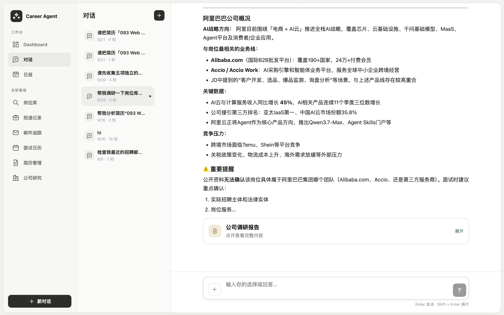
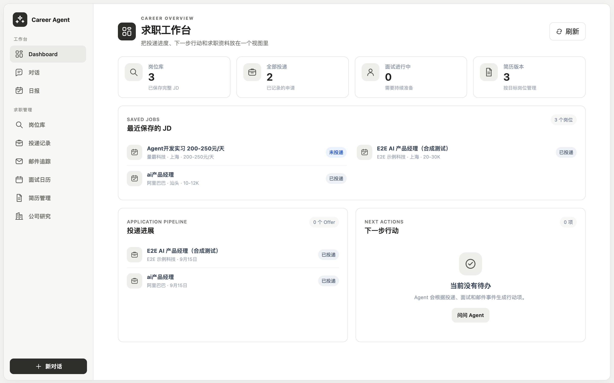
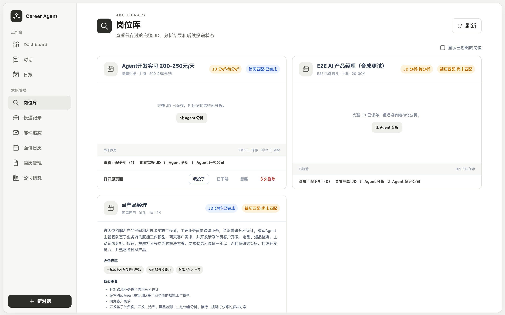
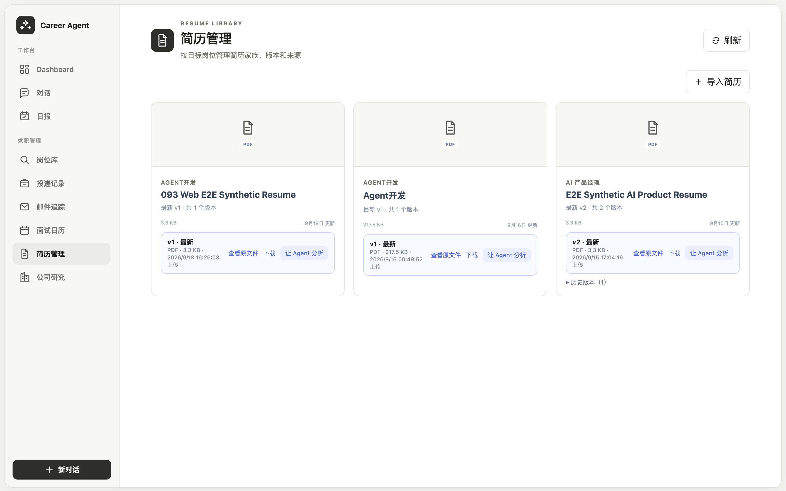

<div align="center">

# MyCareer

**把整个求职流程装进一个你自己掌控的工作区**

岗位、简历、投递、面试、邮件和长期记忆放在一起，由一个会用工具的 Agent 驱动——
所有对外的动作，都要你点头才会发生。

[](https://github.com/low-hands/MyCareer/stargazers)
[](LICENSE)
[](https://www.python.org/)
[](https://nodejs.org/)
[](https://langchain-ai.github.io/langgraph/)
[](#开发验证)
[](#数据与隐私)

</div>

---

求职的难处很少是"不会写简历"，而是信息散落各处：JD 在浏览器里、简历在文件夹里、投递进度在脑子里、面试安排在邮箱里。等到要判断"这个岗位值不值得投"的时候，没有一个地方能同时回答。

MyCareer 把这些放进同一个本地工作区，并交给一个能调用工具的 Agent 去串起来。它跑在你自己的机器上，数据落在你自己的 SQLite 里，没有中心服务器。



<sub>Agent 针对岗位库里的一个岗位完成公司调研，并在给出结论的同时标出"公开资料无法确认"的部分。</sub>

## 它和"再来一个简历生成器"的区别

<table>
<tr>
<td width="33%" valign="top">

### 🔒 不替你编造

未经你确认的推断被隔离在一边，**不能**进入推荐或匹配。简历定制的每一条修改都必须引用原文的逐字片段；岗位要求如果简历里没有，它只能记成待补缺口，不能拿"沾边的经历"充数。

</td>
<td width="33%" valign="top">

### ✋ 不替你决定

写日历、发邮件这类动作走 **提案 → 你确认 → 执行 → 留痕**；删除记忆、退休约束这类破坏性操作还要额外的 UI 封印。模型可以建议，但绕不过这道闸。

</td>
<td width="33%" valign="top">

### 🔁 说得出为什么

每次模型决策、工具调用、token 与缓存指标都落 SQLite trace。固定场景可以用 cassette 回放，并把"**模型选错了**"和"**Runtime 兜住了没有**"分开评估——而不是笼统地说一句"效果不错"。

</td>
</tr>
</table>

## 能做什么

| | 模块 | 已实现能力 |
| :-: | --- | --- |
| 💬 | **对话式 Agent** | 流式对话、多步工具调用、结构化 observation、Human-in-the-loop 确认、一次提交的结构化问卷、分阶段进度反馈、失败恢复与幂等回放 |
| 🔍 | **岗位库** | 通过 Chrome 扩展显式保存 BOSS JD、完整 JD 快照、本地检索、岗位比较、关闭与追求状态管理 |
| 📄 | **简历库** | 导入 PDF/TXT/Markdown、不可变版本管理、查看与下载原文件、在对话中精确绑定某个版本 |
| 🧩 | **简历分析** | 提取履历事实、让用户确认或修正、基于岗位做匹配分析，未经确认的推断不能直接成为候选人事实 |
| ✍️ | **简历定制** | 基于指定简历版本和完整 JD 生成修改建议、先返回可查看草稿，再后台 Reviewer 校验；审核状态明确后逐项审阅、生成并下载定稿 |
| 🏢 | **公司调研** | 针对已保存岗位检索公开资料，保存来源与报告，并校验报告和目标公司的实体绑定 |
| 📮 | **投递管理** | 记录投递、维护状态和事件流、生成行动项与每日 brief |
| 🎤 | **面试** | 记录面试轮次、生成岗位相关准备材料、进行可暂停和恢复的模拟面试并生成复盘报告 |
| 📬 | **邮件与日历** | Gmail 只读同步、QQ IMAP、招聘邮件识别、Google Calendar 预览与确认后写入 |
| 🧠 | **长期记忆** | 管理已确认履历事实和偏好、隔离 Agent 未确认推断、BM25 检索及可选向量检索、修订和删除传播 |
| 🛡️ | **本地可靠性** | API key 权限隔离、单实例锁、并发背压、外部写入确认、执行状态持久化、备份/校验/恢复 |

### 各功能怎样判断结果

这里的“评分”不是把所有信息压成一个无法解释的总分。每个功能都保留判定依据；资料不足时返回“未知/证据不足”，不会用中间分代替不确定性。

| 功能 | 输出 | 判定方式 |
| --- | --- | --- |
| 岗位分析 | S/A/B/C 要求分级、岗位级别、分析限制 | **S** 是 JD 明确写出的硬门槛，**A** 是岗位核心要求，**B** 是重要加分项，**C** 是锦上添花；每条都保留 JD 引文、事实/推断类型和置信度。用户可以修正分级，修正会保留原模型判断和理由。 |
| 简历分析 | 履历事实草稿、证据引文 | 不给候选人打分。模型只能提取简历明确写出的事实，每条事实必须绑定原文位置和完整段落；用户确认后才进入长期履历事实。 |
| 简历 × 岗位匹配 | 逐条 `matched / partial / missing / unclear`，整体 `strong / moderate / weak / insufficient_evidence` | 只看 S/A 要求。S 类事实要求缺失会得到 `weak`；大量 `unclear` 得到 `insufficient_evidence`；`strong` 要求事实项没有缺失或不明确、S 全部匹配，且 A 类至少有匹配并且匹配不低于部分匹配。所有正向判断都要引用指定简历版本。 |
| 岗位比较 | 简历适配、要求覆盖、薪资披露、地点、岗位状态 | 要求覆盖率只计算可判断的 `matched / partial / missing`：`(matched + 0.5 × partial) / 可判断项`。≥90% 为 `full`，≥70% 为 `most`，≥40% 为 `partial`，其余为 `little`；`unclear` 不进分母。没有资料时显示 `unknown`。 |
| 简历定制 | 修改草稿、缺口处理、审核状态 | 修改必须能回指简历或已确认事实；缺口按稳定 requirement ID 覆盖。`pending` 表示后台审核未完成，`passed` 才能进入定稿，`blocked` 必须处理问题。用户仍需逐条接受或拒绝修改。 |
| 模拟面试 | 每题等级、维度分数、复盘报告 | 每题给 `strong / adequate / weak / insufficient_evidence`，并分别按准确性、相关性、具体性、结构、推理、表达 1–5 分；分数附反馈和未支持的主张，不计算脱离回答内容的总分。 |
| 公司调研 | 带来源的公司与岗位报告 | 不做无来源的“好公司”评分。结论必须绑定目标公司和可追溯公开来源；无法确认的内容单列为限制。 |
| 投递、邮件、日历 | 状态、事件、行动项、待确认提案 | 这些功能主要记录事实和状态，不把邮件匹配或日程同步伪装成模型评分；外部写入必须经过用户确认。 |

因此，“匹配度”回答的是简历证据与岗位要求的关系，“覆盖率”回答的是要求逐项完成程度；两者都不是录用概率，也不会替代用户对岗位、薪资和职业方向的判断。

## 一次完整的闭环

**存下 JD** → **导入简历** → **分析并确认履历事实** → **匹配（版本 × 岗位）** → **返回定制草稿** → **后台审核** → **逐项审阅并定稿** → **记录投递** → **面试准备与模拟** → **邮件与日历（确认后写入）**

<table>
<tr>
<td width="50%"></td>
<td width="50%"></td>
</tr>
<tr>
<td><b>工作台</b><br><sub>投递进度、最近保存的 JD 和下一步行动在同一个视图里。</sub></td>
<td><b>岗位库</b><br><sub>完整 JD 快照、结构化分析状态、简历匹配状态和投递状态。</sub></td>
</tr>
<tr>
<td colspan="2"></td>
</tr>
<tr>
<td colspan="2"><b>简历管理</b><br><sub>按目标岗位组织简历家族；每个版本不可变，可查看原文件，并能在对话中被精确绑定。</sub></td>
</tr>
</table>

## 架构

- **Main Agent：** 基于 LangGraph 实现 `hydrate → decide → authorize → act → observe → present/interrupt` 的 ReAct 控制循环，负责理解当前请求并决定下一步；每次只执行一个工具，工具结果以结构化 observation 回灌模型。
- **专家工作流：** 岗位调研和简历定制使用 Deep Agents 执行受约束的领域任务；模拟面试使用带 SQLite checkpoint 的 LangGraph 子图，支持暂停、恢复和复盘。
- **渐进式披露：** Main Agent 按 `tool_profile` 分档提供工具，而不是每轮交出全集：`core` 档 16 个工具（13,069 字符 schema），全集 71 个（65,388 字符），最大的领域档也只占全集的 48%。换档只能由模型显式调用 `route_to_capability` 完成，没有任何关键词规则替它猜领域——复合请求是一串路由，不是一次分类。档案内 schema 字节稳定，所以前缀缓存在一个领域内始终命中，只在换档时失效一次。`authorize` 会拒绝档外工具，因此过滤不只是把菜单藏起来。专家侧另有一层：调研和定制 Worker 通过 Deep Agents 的 Skills 系统按需读取领域说明；模拟面试只为当前 `plan/ask/evaluate/report` 操作装配相关参考资料。
- **确定性 Runtime：** Runtime 负责参数校验、资源归属、公司实体绑定、权限预算、幂等、持久化和副作用；模型负责判断和生成内容，但不能绕过这些执行约束。
- **上下文工程：** 当前轮只装配与任务有关的会话摘要、状态、已确认资料和必要文档摘录；完整 JD、简历和报告保存在业务库中，在明确选中后按需读取，避免让无限增长的历史直接占满模型窗口。
- **可治理记忆：** 记忆区分已确认事实、待确认偏好和 Agent working notes；未确认推断被隔离，不能直接影响推荐或匹配，同时保留来源、版本、修订和派生内容删除语义。
- **可回放评测：** SQLite Runtime trace 记录模型决策、工具调用、结果状态、token 与缓存指标；trajectory cassette 可以回放固定场景，并将模型选错第一步和 Runtime 是否成功兜底分开评估。

## 当前状态

**已经可以作为本地个人版使用。** 当前代码已覆盖从岗位采集、简历分析到投递和面试准备的主要流程，数据会持久化到本机 SQLite；刷新页面、重启服务或切换对话后，可以重新读取已经保存的业务状态和报告。

最近一次完整自动化验证：后端 **2231 passed，1 xfailed**，前端 **106 passed**（21 个文件）。

唯一的 xfail 记录的是模型第一步偶尔选错工具的行为评测：`working_notes_never_choose_or_rank_a_job` 在 3 个录制样本中有 1 个从未确认的 working notes 直接比较岗位，另外 2 个正确地要求用户确认。它被保留为可见的红线，而不是重录到绿。涉及未确认偏好、公司报告绑定的实际执行路径已有 Runtime 兜底，明确历史范围场景最坏会多问一次，不会用附近无关内容冒充答案。

它目前仍是本地 MVP，**不应**直接作为公网、多用户或多实例服务部署：

- 后端只支持单进程、单 worker；同一套数据库不能同时由多个 API 实例打开。
- 对话、分析、调研、定制和模拟面试依赖配置的 OpenAI-compatible 模型服务；供应商超时或 `429/502/503/504` 会影响对应功能。
- BOSS 扩展依赖当前页面 DOM，BOSS 改版后可能需要更新选择器；它不会绕过登录或风控。
- Gmail、Google Calendar 和 QQ 邮箱需要单独完成账号授权。
- 当前没有后台调度器，邮件同步、日报刷新和日历操作仍由用户主动触发。

## 快速开始

> **需要：** Python 3.11+ · [uv](https://docs.astral.sh/uv/) · Node.js `^20.19.0` 或 `>=22.12.0` · 一个 HTTPS OpenAI-compatible 模型接口
> 采集 BOSS 岗位还需要 Chrome / Edge / Brave / Arc 等 Chromium 浏览器。

**1 — 安装依赖**

```bash
uv sync --extra test
cd web && npm ci && cd ..
```

**2 — 配置模型**

```bash
cp .env.example .env
```

至少填下面两组，两组可以先指向同一个模型服务：

```dotenv
# Main Agent：负责对话、任务路由和工具选择
MAIN_AGENT_BASE_URL=https://你的服务/v1
MAIN_AGENT_API_KEY=你的密钥
MAIN_AGENT_MODEL=你的模型名
MAIN_AGENT_TIMEOUT_SECONDS=120

# 专家模型：负责简历分析/匹配/定制、调研、邮件处理和模拟面试
RESUME_ANALYSIS_AGENT_BASE_URL=https://你的服务/v1
RESUME_ANALYSIS_AGENT_API_KEY=你的密钥
RESUME_ANALYSIS_AGENT_MODEL=你的模型名
```

`BASE_URL` 可以填 `/v1` 基地址，也可以直接填完整的 `/chat/completions` 地址。`.env` 已被 Git 忽略，不要提交任何真实密钥。

**3 — 创建本地 API key**

两条命令必须用相同的 `--user-id`，这样 Web 和扩展保存的数据属于同一个本地用户：

```bash
uv run career-agent api-keys issue --user-id local-user --name local-web \
  --scope workspace:read --scope workspace:write \
  --scope chat:write --scope settings:write --no-expiry

uv run career-agent api-keys issue --user-id local-user --name boss-extension \
  --scope capture:write --no-expiry
```

每条命令只会显示一次 `secret`。在 `web/.env` 中分别填写：

```dotenv
CAREER_AGENT_WEB_API_KEY=第一条命令返回的_secret
VITE_CAPTURE_API_KEY=第二条命令返回的_secret
```

Web key 由 Vite 本地代理注入请求；权限更窄的 capture key 只交给 BOSS 扩展。`web/.env` 同样已被 Git 忽略。

**4 — 启动**

```bash
uv run career-agent-api        # 终端一，默认 http://127.0.0.1:8000
cd web && npm run dev          # 终端二，默认 http://127.0.0.1:5173
```

`curl http://127.0.0.1:8000/health` 表示 HTTP 服务已启动，`/ready` 表示模型配置和 Runtime 也已初始化。`ready` 返回 503 时，按响应里的配置错误检查 `.env`。修改 `web/.env` 后需要重启 Vite。

**5 — 安装 BOSS 岗位收藏扩展（可选）**

1. 在 Chrome 打开 `chrome://extensions` 并启用"开发者模式"。
2. 点击"加载已解压的扩展程序"，选择仓库中的 `browser-extension/`。
3. 用**同一个 Chrome profile** 打开 Career Agent Web 页面，并在该 profile 中登录 BOSS。
4. 正常打开 BOSS 岗位详情；扩展解析完整 JD 后会在右下角显示保存卡片，只有你点击后才写入本地岗位库。

扩展不会自动搜索、滚动、投递、发送消息，也不会读取 Cookie 或绕过平台验证。完整说明见 [browser-extension/README.md](browser-extension/README.md)。

## 第一次这样用

1. 在"简历管理"导入 PDF、TXT 或 Markdown 简历；也可以在对话框用"+"或拖拽文件导入，二者写入同一个简历库。
2. 打开该简历的原文件确认版本无误，再让 Agent 分析并确认提取出的履历事实。
3. 使用扩展保存一个完整 BOSS JD，或先浏览已经保存的岗位库。
4. 在对话中让 Agent 比较岗位、分析"指定简历版本 × 指定岗位"，或生成公司调研。
5. 发起简历定制。系统会先保存并返回草稿，随后在后台完成自动审核；读取草稿时，`automated_review_status` 会显示 `pending`、`passed` 或 `blocked`。
6. 等自动审核通过后，逐项接受或拒绝修改，再生成和下载定稿。审核未完成或未通过时，系统不会允许定稿。
7. 记录投递和面试轮次，再生成面试准备材料或开始模拟面试。
8. 如有需要，连接 Gmail/QQ 邮箱与 Google Calendar；所有外部写入仍需显式确认。

对话附件只发送 `resume_version` 的内部引用。Runtime 会校验该版本是否属于当前用户，并只向模型装配任务所需的元数据和有界文本；对话 transcript 不保存一份重复的简历原文。删除简历后，旧对话仍保留名称等安全快照，但不能继续读取已删除文件。

### PDF 简历的交互路径

文本层 PDF 会在本地提取一次带页码的段落，并按内容摘要缓存；岗位匹配、简历定制、自动审核和定稿复用这份准备结果，避免每个阶段重复解析。扫描件、混合页面、超大文件或解析失败会保留原始 PDF 路径，并把证据质量降级为可见的 OCR/未验证状态，不会把不确定内容伪装成精确引文。

简历定制采用两阶段流程：第一阶段完成服务端证据、缺口和 grounding 校验后立即保存草稿；第二阶段在后台运行自动 Reviewer 并回写审核轨迹。用户可以先查看修改建议，但只有审核通过且逐条完成接受/拒绝后才能定稿。后台失败会标记为 `blocked`，不会丢弃已经保存的草稿。

## 数据与隐私

- 业务数据默认保存在 `~/.career-agent/` 下的多个 SQLite 文件和 `working-notes/`；API key 默认保存在仓库的 `data/api_keys.sqlite3`。
- 岗位、简历、投递、对话和报告默认不会上传到本项目自建服务器——因为项目没有中心服务器。
- 这不是完全离线应用：执行模型任务时，当前任务所需的提示、资料摘录或正文会发送到你配置的模型服务；使用 Google、QQ 或 BOSS 时，也受相应外部服务的数据政策约束。
- Gmail/Calendar/QQ 的连接凭据保存在系统 keyring，页面和 API 不回传 secret；`.env` 中的模型和 OAuth 密钥仍由本机用户负责保护。

## 备份与恢复

工作区包括 `~/.career-agent/*.sqlite3`、`~/.career-agent/working-notes/` 和 `$CAREER_AGENT_DATA_DIR/api_keys.sqlite3`。建议在开始保存正式简历和求职记录前就建立备份习惯：

```bash
uv run career-agent backup create
uv run career-agent backup create --dest /Volumes/usb/career-2026-09-14
uv run career-agent backup verify --source ~/.career-agent-backups/20260914T120000Z
uv run career-agent backup restore --source ~/.career-agent-backups/20260914T120000Z --yes
```

- `create` 使用 SQLite 在线备份 API 逐库复制，运行 `integrity_check` 并生成包含文件大小和 SHA-256 的 `manifest.json`。
- 创建和恢复一致性备份前必须停止 API；命令取不到 `api-server.lock` 时会拒绝运行。`--allow-running-api` 会将备份明确标记为不一致快照。
- `verify` 检查文件、摘要和 SQLite 完整性；`restore` 只有在校验通过后才覆盖，并默认先创建 safety copy。
- 如果使用非默认数据库路径，给 `backup` 传入与 `chat` 相同的 `--*-store` 参数。

## 开发验证

```bash
uv run pytest
cd web
npm run test
npm run typecheck
npm run build
```

后端 API 契约变更后，按仓库现有 contract 生成流程更新 `web/src/contracts/api-contract.ts`，再运行前端测试和构建。

---

<details>
<summary><b>🔧 模型与超时的完整配置</b></summary>

<br>

**可选的 specialist 配置**

- `RESUME_ANALYSIS_AGENT_API_PROTOCOL`：简历分析的请求协议，可选 `chat_completions`（默认，Chat Completions JSON Schema）或 `responses`（显式的 Responses 文本适配器）。必须显式设置，不会按模型名推断。
- `RESUME_ANALYSIS_AGENT_DISABLE_THINKING=true`：显式发送百炼参数 `extra_body={"enable_thinking": false}`。项目不会按模型名或 hostname 自动开启；不识别该参数的端点会返回 400 并 fail closed，不会删除参数后重试。
- `JOB_RESEARCH_AGENT_BASE_URL` / `_API_KEY` / `_MODEL`（可选 `_TIMEOUT_SECONDS`，默认 30，范围 1–120）：公司研究的独立端点。整组都不设置时，复用 `RESUME_ANALYSIS_AGENT_*`；设置了任意一项，就必须三项齐全，否则启动失败，不会混用两组凭据。该端点必须支持 Responses 原生 `web_search` 工具，使用前先运行 `python -m career_agent.agent.job_research_provider_smoke --work-root <目录> --report <新文件>`。公司研究的模型调用使用流式传输：一次深度调研可能持续数分钟，非流式请求会被带空闲超时的网关（例如 Cloudflare 的 100 秒 524）在返回前切断。

**简历分析的真实模型回归**

先创建 `output` 目录，再运行 `python -m career_agent.agent.resume_analysis_provider_smoke --pdf tests/fixtures/resume_analysis_smoke.pdf --work-root output --report output/resume-smoke-<新名称>.json`。它用仓库内合成英文 PDF 和合成中文文本分别完成导入、分析、待确认草稿回读与来源逐段校验；报告只写计数和脱敏错误类别。每次使用新的报告文件名。

**超时的真正天花板是网关，不是客户端**

specialist 的超时配置（`--agent-timeout-seconds`，默认 300）是**客户端上限，不等于实际可用时长**。当前部署实测，非流式请求在约 100 秒被网关切断（返回 524，归类为 `time_budget`，不会自动重试）。公司研究因此改用流式传输——流式一旦开始输出就不再受空闲计时器限制（实测同端点流式可跑 391 秒）。其余 specialist 仍是非流式；当前合成 PDF 简历分析实测约 42 秒，中文文本约 21 秒，均低于该限制。如果将来有能力稳定接近 100 秒，应当为它也启用流式，而不是调大超时值。

**两层重试语义**

`MAIN_AGENT_TIMEOUT_SECONDS=120` 是当前推荐值。Main Agent 对连接错误以及 `429/502/503/504` 最多做 3 次有限指数退避；持续不可用时会明确失败，不会无限重试或把不完整回答交给用户。

专家能力另有一条独立的重试：模型返回不符合 schema 的结构化输出时，会用**完全相同的请求**重发一次。这类失败实测是采样方差而非确定性错误（同一次评审调用重试 5/5 通过），而在它之前完成的工作可能已经花了一两分钟，丢弃代价过高。重试没有"修复提示"，因为要纠正的是一次坏采样，不是模型理解错了指令；预算用尽后失败即终态，Main Agent 不会再把整个能力重跑一遍。每次重试都会记一条 `model_retry`，所以重试率上升是可观测的信号，而不会被悄悄计成延迟。

</details>

<details>
<summary><b>🧮 上下文压缩与独立摘要模型</b></summary>

<br>

生产默认使用 `CONTEXT_RECENT_MESSAGE_LIMIT=16`、`CONTEXT_SUMMARY_BATCH_SIZE=8`、`CONTEXT_COMPACT_OCCUPANCY_THRESHOLD=0.75`。部署范围分别为 **2–64**、**2–32**、**0.7–0.9**（含端点）；空值、非数字或越界值会使启动失败。75% 衡量的是包含系统提示、工具 schema 和动态上下文的**完整输入请求**，不是只计算聊天正文。单条长消息仍可提前触发 occupancy；待摘要历史不足一个 batch 时不会压缩当前未提交消息。

`projection_overflow` 仍保留：未摘要原始窗口最多为 `recent + batch - 1`（默认 23）条，摘要按顺序推进 watermark，不能先隐藏旧消息再遗漏摘要范围。原始历史持久保存，可按明确范围 page-in；增大 recent 条数**不增加**其 token 总预算，也不挤占当前轮 observation 和输出预留。低于 occupancy、没有 workflow seam 的 30-message 合成回归最多压缩两次；它不等价于私有真实会话的精确重放。

`MAIN_AGENT_CONTEXT_WINDOW_TOKENS` 默认 `65536`，必须按实际模型窗口配置（范围 2048–2000000）。启动会检查 `MAIN_AGENT_MAX_INPUT_TOKENS + MAIN_AGENT_MAX_OUTPUT_TOKENS` 不超过该值；当前默认 `32000 + 16384`。这是部署声明，不按模型名称或 hostname 猜测 provider 能力。token 估算使用项目现有 cl100k_base，不是所有供应商 tokenizer 的精确上界；切换模型时仍需核对模型限制并做 smoke。不要仅为通过检查虚增窗口。

可用 `python -m career_agent.agent.context_window_provider_smoke --report output/context-window-<新名称>.json` 对已配置的 Main Agent 端点发送一次合成的近窗口探测。报告仅包含本地估算、供应商 usage、三个位置的标记校验和脱敏错误类别；此调用可能消耗数万输入 token。若要缩短输出预留，可显式设置 `--target-input-tokens` 与 `--output-budget`，两者之和不得超过声明窗口。

Conversation Summary Worker 使用 **Chat Completions JSON Schema**，可独立选用更快、更便宜的结构化模型：

```dotenv
CONVERSATION_SUMMARY_AGENT_BASE_URL=https://你的摘要服务/v1
CONVERSATION_SUMMARY_AGENT_API_KEY=你的摘要密钥
CONVERSATION_SUMMARY_AGENT_MODEL=你的摘要模型
CONVERSATION_SUMMARY_AGENT_TIMEOUT_SECONDS=30
CONVERSATION_SUMMARY_AGENT_MAX_INPUT_TOKENS=32000
CONVERSATION_SUMMARY_AGENT_MAX_OUTPUT_TOKENS=1200
CONVERSATION_SUMMARY_AGENT_CONTEXT_WINDOW_TOKENS=65536
CONVERSATION_SUMMARY_AGENT_DISABLE_THINKING=true
```

整个 `CONVERSATION_SUMMARY_AGENT_*` 命名空间未设置时，会显式兼容回退到 Main 的 endpoint/key/model/input capacity/context window，摘要自身仍使用独立 **30 秒 timeout / 1200 output token** 默认值，而非 Main 的 120 秒。`CONVERSATION_SUMMARY_AGENT_DISABLE_THINKING` 是唯一可单独设置的非连接选项：单独出现时仍复用 Main 连接，只覆盖 thinking 请求参数。设置其他任一摘要变量后，三项连接配置必须齐全且非空；未知变量、部分配置、无效配置或 provider 拒绝都不会静默切回 Main。`DISABLE_THINKING` 与简历分析开关相同，是显式的百炼请求参数；端点不支持时 400 fail closed。摘要 timeout 范围 1–120 秒、输入 1024–2000000、输出 256–16384、窗口 2048–2000000，输入加输出必须小于等于实际窗口。`max_tokens` 是包含 reasoning token 的完整输出预算；本地截断判断使用供应商返回的总 `completion_tokens`，推理耗尽预算且正文为空不会被当作成功。请求在本地做包含 schema 的输入预算检查，超预算、截断、空正文或无效结构化结果 fail closed，不推进 watermark；已有失败退避与历史恢复机制保留。摘要客户端不自动重试，避免重复延长同一 turn 的等待。此配置独立于 `RESUME_ANALYSIS_AGENT_*`，不改变其他 specialist 的选择。

</details>

<details>
<summary><b>⚙️ 单进程限制与并发边界</b></summary>

<br>

后端是本地 SQLite、单进程部署，**只支持单 worker**：

```bash
uv run career-agent-api                              # 固定 workers=1
uv run uvicorn career_agent.api.app:app --workers 1 # 也可以
```

不要使用 `--workers 2+`、`WEB_CONCURRENCY>1`，也不要让多个 API 实例共用默认的 `~/.career-agent/*.sqlite3`。启动时进程会取得 `~/.career-agent/api-server.lock`；第二个实例会立即失败，进程退出后锁由内核释放。

会写数据库的 CLI 命令也使用同一把锁，因此 API 运行时会拒绝执行 `chat`、`actions settle`、`memory apply`、`settings set`、`target-role create`、`resume import`、`email/calendar add-account` 和 `api-keys issue/revoke`。只读命令不取锁。

同一进程默认最多同时运行 3 个 turn，可用 `CAREER_AGENT_MAX_CONCURRENT_TURNS` 修改。达到上限时 API 返回 `503 TURN_CAPACITY_EXHAUSTED`；同一对话已有 turn 在运行时返回 `409 CONVERSATION_TURN_IN_PROGRESS`。关闭服务会先等待正在执行的 turn，默认排空时间为 30 秒，可用 `CAREER_AGENT_SHUTDOWN_DRAIN_SECONDS` 调整。

</details>

<details>
<summary><b>📬 连接 Gmail、Google Calendar 与 QQ 邮箱</b></summary>

<br>

### Gmail OAuth

Gmail 连接需要先创建 Google OAuth Client。普通用户授权 Gmail 时不会看到或填写 Client Secret。

1. 打开 [Google Cloud Console](https://console.cloud.google.com/) 并创建或选择项目。
2. 在 API Library 启用 **Gmail API**。
3. 在 Google Auth Platform 配置 OAuth consent screen；测试模式下把自己的 Google 邮箱加入 Test users。
4. 在 Clients/Credentials 中创建 **Web application** 类型的 OAuth Client。
5. 添加 Authorized redirect URI：`http://127.0.0.1:8000/v1/connections/google/callback`。
6. 在仓库根目录的 `.env` 中添加：

   ```dotenv
   GOOGLE_OAUTH_CLIENT_ID=你的_Client_ID
   GOOGLE_OAUTH_CLIENT_SECRET=你的_Client_Secret
   GOOGLE_OAUTH_CALLBACK_URL=http://127.0.0.1:8000/v1/connections/google/callback
   CAREER_AGENT_WEB_URL=http://127.0.0.1:5173
   ```

7. 重启后端，在"邮件追踪"页面点击"连接 Gmail"。该入口只申请 Gmail 只读权限。

不要把 Client Secret 提交到仓库或放入 `web/.env`。

### Google Calendar（可选）

项目内置面试月历不依赖 Google Calendar。不连接 Google 时，项目中的面试仍会显示在前端月历。

如需同步到 Google Calendar，在同一个 Google Cloud 项目启用 **Google Calendar API**，复用上面的 OAuth Client 和回调地址，再从"面试日历"页面连接。Calendar 入口只申请日历事件权限；外部写入经过 proposal → 用户确认 → 执行 → 审计流程。

### QQ 邮箱

QQ 邮箱使用 IMAP 授权码，不使用登录密码：

1. 登录 [QQ 邮箱网页版](https://mail.qq.com/)。
2. 打开"设置 → 账号与安全 → 安全设置"。
3. 开启 IMAP/SMTP 第三方客户端服务并生成授权码。
4. 在应用"邮件追踪"页面点击"连接 QQ 邮箱"。
5. 填写完整 QQ 邮箱地址和授权码。

授权码保存在系统 keyring；页面和 API 不会返回授权码或邮件正文。

</details>
