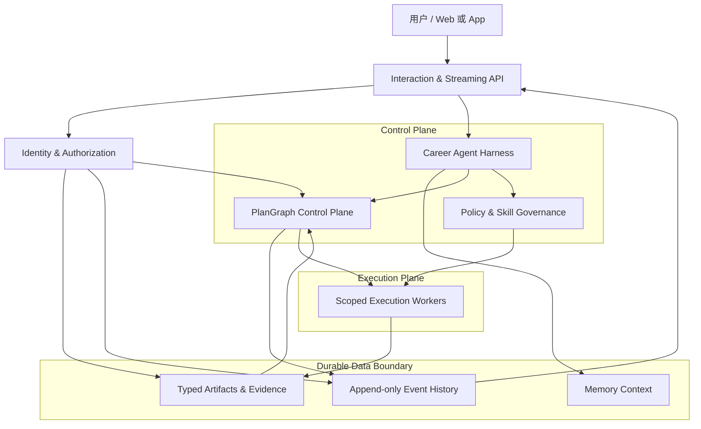
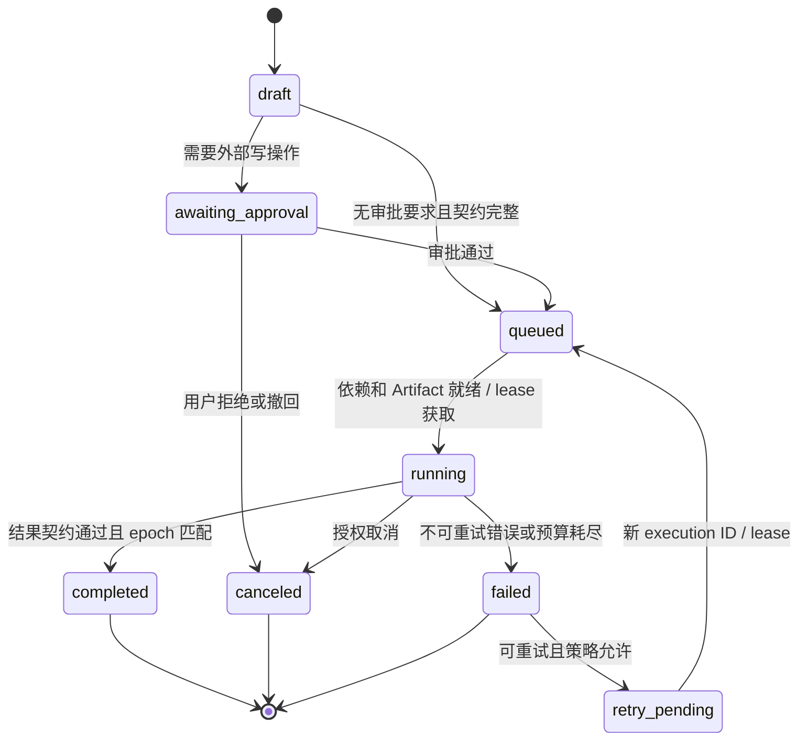
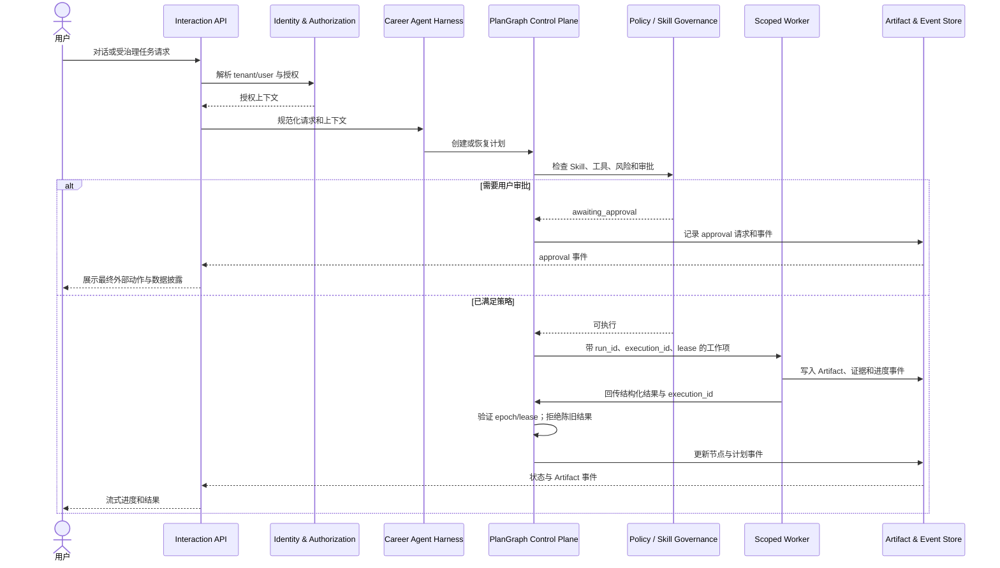

# Career Agent 架构选型与边界决策

- **状态**：已选型，待实施
- **决策日期**：2026-08-14
- **范围**：Career Agent 的交互、编排、Skills、工具、记忆、Artifact、审批、审计与安全边界。
- **非目标**：本文不实现服务、不锁定数据库/队列/云厂商，也不授权自动投递、邮件发送、日历写入或招聘平台连接。

## 1. 背景与决策

Career Agent 需要在一个连续对话中完成职业资料管理、岗位与公司调研、简历定制、面试训练及后续申请追踪等多步骤工作。它不能退化为一组彼此割裂的页面工作流；同时，简历、联系方式、薪资预期、邮件和外部投递动作又要求比一般聊天机器人更强的隔离、证据与审批机制。

本次调研将 AGI-saber、AGI-OpenResearch 和 AGI-Gilgamesh 视为**架构模式来源**，而非可直接 fork 的生产依赖。三者均包含值得复用的控制面思想，也都有不适合 Career Agent 的原型边界。

### 决策摘要

Career Agent 采用混合架构：

1. **统一的用户面对 Agent 与流式交互 Harness**：借鉴 AGI-saber 的统一交互、分层记忆和按用户启用 Skills 的模式。[SABER-1][SABER-2]
2. **持久化、Artifact 驱动的 PlanGraph 控制面**：借鉴 AGI-OpenResearch 的任务契约、依赖检查、审批、事件、重试、执行租约与陈旧结果拒绝机制。[OPEN-1][OPEN-2][OPEN-3]
3. **受审核 Skill manifest、静态工具分派与执行前策略校验**：借鉴 AGI-Gilgamesh 的 `Plan → Step → Result → Artifact` 结构和固定 handler registry。[GIL-1][GIL-2][GIL-3]

这不是把三套系统拼接在一起。Career Agent 将保留它们的架构意图，并明确替换不安全或无法扩展的实现方式：任意 HTTP/MCP 注册、进程全局取消、JSON 快照作为生产真相、客户端声明身份、任意文件路径、同步长任务与缺少审批的外部写操作均不予继承。

## 2. 选型原则

1. **统一体验，不使用全局单例运行时**：用户面对的是一个连续的 Career Agent；执行状态必须归属到 `tenant_id`、`user_id`、`conversation_id`、`plan_id` 与 `run_id`，不能共享为整个服务的全局任务。
2. **长期工作由 PlanGraph 与 Artifact 驱动**：多步骤任务使用声明输入、输出、依赖、审批、重试与预算的节点图表示；聊天记录不能充当工作流的事实来源。
3. **策略先于执行**：模型可以建议计划和选择经批准的能力，但不能动态注册外部能力、绕过权限或直接执行高风险动作。
4. **证据优先于模型记忆**：跨步骤协作以有来源和版本的 Artifact 为准；记忆只用于个性化与上下文补充。
5. **租户隔离与隐私优先**：用户资料、简历版本、申请记录、外部账户和审计记录必须在服务端的身份与授权边界内隔离。
6. **组件可替换**：计划存储、事件流、Worker、记忆检索和身份提供方均通过稳定契约连接，避免在首次设计时绑定具体基础设施。

## 3. 调研范围与证据说明

| 引用键 | 调研对象 | 在本决策中的角色 | 证据类型 |
|---|---|---|---|
| `SABER` | AGI-saber | 统一 Agent、SSE、记忆、Skill 与工具边界 | 本地源码与架构文档 |
| `OPENRESEARCH` | AGI-OpenResearch / Sea-Mult-Agent | PlanGraph、Artifact、审批、事件、租约、重试与恢复 | 本地源码与架构文档 |
| `GILGAMESH` | AGI-Gilgamesh | Plan/Step/Result/Artifact、manifest、静态分派、策略执行 | 本地源码与 README |

本次仅能访问本地下载快照，未将不存在或未验证的提交哈希写入本文。附录中的证据记录以**快照路径、实现位置和调研日期**为准。

## 4. 比较矩阵与选型结论

| 能力/问题 | AGI-saber | AGI-OpenResearch | AGI-Gilgamesh | Career Agent 决策 |
|---|---|---|---|---|
| 统一用户交互 | `UnifiedAgent` 集成对话、RAG、工具与子代理 | 工作流入口以 Planner/Graph 为中心 | `WorkbenchService` 路由不同能力 | **Adopt**：保留单一用户面对 Agent；内部区分对话与受治理工作流 |
| 流式进度 | 前端/后端提供流式聊天与状态能力 | Plan event + SSE 的事件模型 | TUI 将后台处理映射到前台更新 | **Adapt**：统一输出 `conversation / plan / task / approval` 事件，且可重放 |
| 用户记忆 | 有短期、偏好、长期记忆与投影机制 | Redis 短期记忆与持久计划分开 | 会话上下文与 SQL 示例记忆分离 | **Adapt**：显式区分职业 Profile、短期上下文、工作流 Artifact 和可审计证据 |
| 多步骤编排 | 模型规划依赖图与 ReAct 运行时 | PlanGraph、节点契约、依赖与 Artifact 检查 | 顺序 AgentPlanStep | **Adopt**：持久化 PlanGraph 作为长期任务真相；普通聊天不强制建图 |
| Artifact 交接 | 偏重对话、记忆和快照 | 节点声明输入/输出 Artifact | Result 产出 JSON Artifact | **Adopt**：每个长期步骤声明并落库 Artifact，禁止隐式跨 Agent 传递关键事实 |
| 审批与取消 | 全局 `cancelAll` 取消所有在途请求 | 计划批准、取消、重试和状态转换 | 没有通用审批模型 | **Adapt**：审批和取消绑定到已授权 `run_id`；外部写操作要求动作级确认 |
| 租约与陈旧结果 | 进程内快照，缺少分布式租约 | execution ID、epoch、lease 与 stale-result 防护 | 同步执行记录 | **Adopt**：Worker 结果仅在 lease/epoch 匹配时写入 |
| Skills | 用户可安装/启用 Skill，服务端解析 manifest | 主要是研究任务模板 | manifest 和 registry 分离 | **Adapt**：Skills 必须版本化、审核并声明输入/输出/工具/风险，支持租户范围启用 |
| 工具分派 | 可通过 HTTP endpoint 动态构建 MCP 类工具 | 抽象工具层但部分实现为 demo/mock | 固定 handler map | **Adopt + Reject**：采用静态、强类型、策略保护的工具 registry；拒绝任意 endpoint 注册 |
| 调度与恢复 | 进程内 ticker/worker | 单节点持久化加调度循环 | 同步 job 与本地存储 | **Adapt**：生产形态应具备事务性状态、幂等派发、队列、Worker、租约与恢复 |
| 身份与隔离 | 部分接口存在服务端未过滤的内存访问风险 | 静态 token/客户端身份模型局限 | 本地单用户导向 | **Reject**：使用服务端鉴权和租户授权；前端筛选与客户端身份声明不构成安全边界 |
| 文件边界 | 文档库与上传能力 | 有上传类型/大小与 SSRF 防护模式 | 可接受绝对本地路径 | **Adapt + Reject**：采用受控上传、扫描、归属、保留与授权；拒绝文本中的任意本地路径 |

### 4.1 从 AGI-saber 采用与拒绝的部分

**采用/改造**

- 统一用户体验：Career Agent 对用户保持单一对话和流式进度界面，不暴露互相割裂的“搜索机器人”“简历机器人”“面试机器人”。
- 记忆分层：将短期对话、用户偏好和长期职业事实分开；职业事实需要来源、置信度、可编辑性、过期与替代关系。
- 以 Skill 作为渐进式加载的领域能力，并允许用户/租户在政策许可内启用特定 Skill。

**明确拒绝**

- 不允许用户或模型在运行时向共享 registry 注册任意 HTTP/MCP endpoint。该模式会绕过出口控制、OAuth 隔离、工具 schema、租户授权和审计。[SABER-4]
- 不使用 `cancelAll` 类型的全局取消。AGI-saber 的 task runtime 将所有在途取消函数聚合到同一实例；Career Agent 必须按已授权的 run 精确取消。[SABER-3]
- 不将内存态、进程内 ticker 或前端过滤作为生产级任务状态、调度和租户隔离机制。

### 4.2 从 AGI-OpenResearch 采用与拒绝的部分

**采用/改造**

- 使用类型化 PlanGraph：节点声明输入 Artifact、输出 Artifact、依赖、重试策略、预算与风险等级。
- 节点只有在依赖完成且所需 Artifact 满足时才可变为 ready；执行前验证 approval 状态。[OPEN-3]
- 以 append-only event history 展示状态，并通过 execution ID、epoch 和 lease 拒绝迟到 Worker 的结果。
- 将“用户需要补充资料”与“用户需要批准外部操作”建模为可恢复状态，而不是让模型在聊天文本中等待。

**明确拒绝**

- 不直接使用研究特化的多 Agent 角色分类、Docker-first 执行模型或 Tree-of-Thought 式探索作为日常职业任务的默认路径。
- 不以单节点 JSON snapshot 文件作为生产持久化来源；它可以作为本地原型，但不满足多 Worker、可靠恢复和租户审计需求。[OPEN-4]
- 不使用静态 bearer token 或客户端提供的身份字段作为真实用户授权。

### 4.3 从 AGI-Gilgamesh 采用与拒绝的部分

**采用/改造**

- 采用 `Plan → Step → Result → Artifact` 契约，确保每个 Career Skill 都有可检查输入、输出和失败类别。[GIL-1]
- 采用静态 handler map 思路：模型只能选择已注册且经策略允许的工具，而不执行模型生成的代码或任意命令。[GIL-2]
- 采用 manifest-backed Skills：Skill 描述触发场景、输入、输出、允许工具、风险、完成条件和交接条件。[GIL-3]

**明确拒绝**

- 不用关键词匹配作为主路由或 Skill 选择；Career 请求常含歧义、长期偏好与上下文，需由 Agent 结合状态和策略选择能力。[GIL-4]
- 不将同步 job、SQLite/JSONL 或本地路径作为长期生产运行模型。
- 不接受用户文本中的任意绝对路径作为可读文件引用。

## 5. 目标逻辑架构

### 5.1 Experience and Interaction Layer

- 接收用户对话、文件上传和显式操作请求。
- 生成可流式消费的 conversation、plan、task、approval 与 artifact 事件。
- 每个请求携带或解析 `tenant_id`、`user_id`、`conversation_id`、`plan_id`、`run_id`；没有这些边界的全局操作一律不成立。

### 5.2 Career Agent Harness

- 决定当前请求是直接对话、轻量 Skill 调用，还是需要创建/继续一个受治理的 PlanGraph。
- 使用记忆补充用户偏好与历史，但不把记忆当成“已投递”“已批准”“简历事实已验证”的来源。
- 只可调用经过 Policy & Skill Governance 允许的工具和 Skill。
- 子代理仅在大型、独立、可并行的研究或评估任务中按需使用，且结果必须回写为 Artifact。

### 5.3 PlanGraph Control Plane

计划、节点、依赖、Artifact contract、审批要求、预算、重试、lease 与事件均为持久化业务状态。

- **Plan**：对应一个可恢复的职业任务，如“调研三个岗位并生成三份简历草稿”。
- **Task node**：有明确的输入/输出、状态、风险与执行限制。
- **Artifact**：例如 `job_posting_snapshot`、`company_research_report`、`resume_evidence`、`tailored_resume_draft`、`approval_receipt`。
- **Event**：记录节点就绪、开始、进度、等待用户、审批、失败、重试和完成。
- **Lease/epoch**：避免重试、重分配或取消后，旧 Worker 覆盖新状态。

### 5.4 Policy and Skill Governance

- Skill 从审核过的版本化 manifest 加载，而不是从用户文本、外部仓库描述或运行时 URL 动态创建。
- 每次执行前检查：身份、租户范围、数据分类、允许的工具、批准状态、预算、限流与出口策略。
- 高风险外部动作——投递、发送邮件、上传简历到第三方、创建/修改日历、修改正式申请状态——必须有动作级 approval。
- 审批内容要展示最终目的地、外部账户、将披露的数据、附件版本和最终正文/参数，而不是只展示一个泛化的“允许计划执行”。

### 5.5 Artifact、Memory 与 Evidence

| 数据类别 | 用途 | 是否可作为工作流真相 |
|---|---|---|
| 短期对话上下文 | 保持当前对话连续性 | 否 |
| 职业 Profile/偏好 | 目标岗位、城市、语言、职业约束 | 仅在有明确来源和用户归属时 |
| Workflow Artifact | JD 快照、研究报告、简历草稿、审批凭证 | 是 |
| Evidence/Provenance | 原始简历证据、公开来源、邮件/用户操作关联 | 是 |
| 审计事件 | 谁在何时发起、批准、取消或执行了什么 | 是 |

## 6. 受治理工作流生命周期

运行守卫：

- 依赖节点已完成，且所需 Artifact 存在并通过 schema/归属校验；
- 风险等级要求的 approval 已经针对当前 payload 获得通过；
- 当前执行拥有有效 lease，且未超出预算或限流；
- 用户和租户授权在执行时仍然有效；
- Worker 回传的 execution ID/epoch 与当前节点匹配，否则记录为陈旧结果并丢弃，不更新节点状态。

## 7. 请求到 Artifact 的时序

## 8. 必须遵守的实施边界

### 8.1 工具与出口边界

- 不支持从用户或模型输入注册任意 HTTP/MCP endpoint。
- 每个外部连接器必须有审核 manifest、静态 registry entry、输入/输出 schema、允许的方法、超时/重试、限流、审计和租户授权。
- OAuth 或其他凭证只能在服务器端的用户/租户凭证边界中使用；不得出现在 Prompt、普通 memory、前端日志或 Artifact 正文中。

### 8.2 运行时与取消边界

- 不存在“取消所有 Agent 请求”的 API。
- 取消必须指定并授权到一个 run 或 plan，并以 durable event 记录。
- Worker 需在安全边界检查取消；取消后的迟到结果不应更新计划。

### 8.3 持久化与调度边界

- 不以 JSON snapshot、单进程 map、goroutine/ticker 或同步循环作为生产级长期任务的唯一真相。
- 后续实现需支持事务化计划/事件写入、幂等派发、可恢复队列、执行租约、退避重试、失败分类和死信/人工处理路径。

### 8.4 身份与隔离边界

- 不信任客户端提供的 `user_id`、静态 token 或前端数据过滤。
- 计划、Artifact、事件流、Memory、审批和取消必须由服务端基于认证身份和租户范围授权。
- 在多人或共享部署前，必须定义配额、审计、保留、导出和删除语义。

### 8.5 文件与 Artifact 边界

- 不将用户文本中的文件路径视为可信输入。
- 未来附件必须通过受认证的上传链路进入：大小和类型限制、内容验证/扫描、归属、完整性元数据、保留策略及授权下载。
- 原始上传、生成 Artifact、对话 Memory 和审计事件应当是不同生命周期的对象。

## 9. 后续实施路线图

### Phase 0：基础契约

- 确定身份和租户模型。
- 定义 PlanGraph、Task、Artifact、Event、Approval、PolicyDecision 的 schema 与状态机。
- 定义可恢复性、审计性、取消粒度、保留和隔离的非功能要求。

### Phase 1：受治理的 Career Agent 核心

- 建立统一交互与流式事件接口。
- 引入 scoped request/run ID。
- 实现最小 PlanGraph control-plane 契约和少量静态 Career Workflow handler。

### Phase 2：持久化工作流与证据

- 持久化计划、事件、审批、Artifact metadata、重试、lease 和陈旧结果拒绝。
- 将 Worker 与请求服务运行时拆分。
- 实现 replay、recovery 和 idempotency。

### Phase 3：Skills 与集成治理

- 引入经过审核的 Skill manifest 和静态 allowlisted dispatch。
- 为外部集成、数据披露和用户审批引入 Policy gate。
- 接入审计、可观测性和安全凭证管理。

### Phase 4：生产硬化

- 集成 OIDC/OAuth 兼容的身份模型与租户授权。
- 增加配额、保留/删除、队列/Worker 部署和横向扩展协调。
- 在满足策略和审批模型后，再评估邮箱、日历、招聘平台或投递连接器。

## 10. 已知代价与延后决定

### 正向结果

- 长任务能以计划、Artifact 和事件解释状态，而不是依赖 Agent 的自然语言承诺。
- Skills 和集成可以扩展，同时保留明确的策略、权限与审计边界。
- 用户体验保持为一个连续 Career Agent，而非一组独立工具。

### 接受的代价

- 在做业务功能前需要更多 schema、策略和状态建模。
- Artifact 与 approval 会增加实现复杂度和部分交互等待。
- 持久化编排的基础设施成本高于单进程聊天原型。

### 本次刻意延后

- 数据库、队列、对象存储、身份供应商和 Worker 引擎的具体选择；
- 具体 Career Workflow 与 Skill 目录；
- Embedding、向量检索和长期记忆检索方案；
- 各风险等级的自动化范围；
- 数据保留期限、辖区与企业治理要求。

## 附录 A：研究证据

| 键 | 本地快照证据 | 支撑结论 |
|---|---|---|
| [SABER-1] | `/Users/guorui/Downloads/AGI-saber-main/README.md`，架构、记忆、Skill 与工具说明；2026-08-14 调研 | 统一 Agent、分层记忆、Skill 模式 |
| [SABER-2] | `/Users/guorui/Downloads/AGI-saber-main/internal/application/chat/core_agent.go`；2026-08-14 调研 | UnifiedAgent 的组合边界 |
| [SABER-3] | `/Users/guorui/Downloads/AGI-saber-main/internal/application/chat/runtime_task.go`，`cancelAll` 聚合所有在途取消函数；2026-08-14 调研 | 全局取消必须改造成 run 级取消 |
| [SABER-4] | `/Users/guorui/Downloads/AGI-saber-main/internal/application/skill/service.go`、`internal/infrastructure/tool/mcp.go`；2026-08-14 调研 | Skill 启用值得借鉴；任意 endpoint 工具注册不可继承 |
| [OPEN-1] | `/Users/guorui/Downloads/AGI-OpenResearch-main/scholar-agent/docs/project_architecture.md`；2026-08-14 调研 | 控制面、执行面和 Artifact 驱动协作 |
| [OPEN-2] | `/Users/guorui/Downloads/AGI-OpenResearch-main/scholar-agent/backend/internal/models/graph.go`；2026-08-14 调研 | 节点与 Artifact contract |
| [OPEN-3] | `/Users/guorui/Downloads/AGI-OpenResearch-main/scholar-agent/backend/internal/scheduler/scheduler.go`，审批检查、依赖/Artifact 就绪、状态、事件、重试与取消；2026-08-14 调研 | PlanGraph 治理和执行状态机 |
| [OPEN-4] | `/Users/guorui/Downloads/AGI-OpenResearch-main/scholar-agent/backend/internal/store/file_plan_store.go`；2026-08-14 调研 | JSON 文件持久化只适于单节点原型 |
| [GIL-1] | `/Users/guorui/Downloads/AGI-Gilgamesh-main/sparkos/domain/agent.py`；2026-08-14 调研 | Plan/Step/Result/Artifact 契约 |
| [GIL-2] | `/Users/guorui/Downloads/AGI-Gilgamesh-main/sparkos/application/spark_tools.py`，固定 `handlers` map；2026-08-14 调研 | 静态 allowlist 工具执行 |
| [GIL-3] | `/Users/guorui/Downloads/AGI-Gilgamesh-main/sparkos/application/skill_registry.py`、`skills/manifest.yaml`；2026-08-14 调研 | Manifest-backed Skill registry |
| [GIL-4] | `/Users/guorui/Downloads/AGI-Gilgamesh-main/sparkos/application/turn_router.py`；2026-08-14 调研 | 关键词/路径路由不适合 Career Agent 主控制面 |

